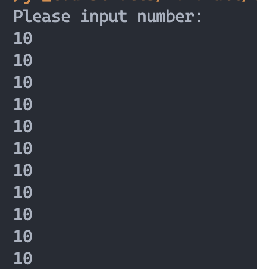
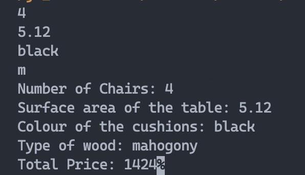
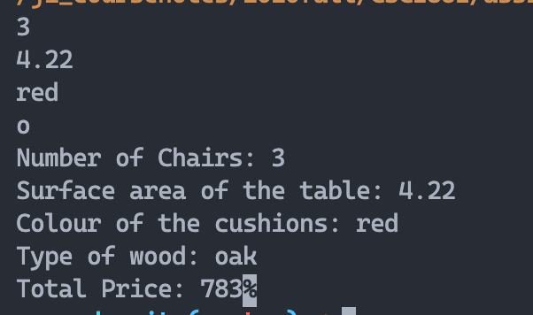

## Lab 2
### Part One
#### 2.
```cpp
#include <iostream>
using namespace std;
int main() {
    string name;
    cout << "Please input your name:" << endl;
    cin >> name;
    cout << "Hello " << name << "!" << endl;
    return 0;
}
```

#### 3.


#### 4.
```cpp
#include <iostream>
using namespace std;
int main() {
    float name;
    cout << "Please input your name:" << endl;
    cin >> name;
    cout << "Hello " << name << "!" << endl;
    return 0;
}
```


### Part Two
#### 1.
```cpp
int main(){
    cout << "Hello" << endl;
}
```

#### 2.
```cpp
#include <iostream>
using namespace std;
int main(){
    int value = 5;
    cout >> value  >> endl;
}
```


#### 3.
```cpp
#include <iostream>
using namespace std;
int main() {
    int value;
    cout << "Enter an integer : ";
    cin << value;
}
```


#### 4.
```cpp
#include<iostream>
using namespace std;
int main() {
    int value = 2;
    cout << value << 2 << endl;
    cout << (value << 2) << endl;
    cout << value >> 2 >> endl;
    cout << (value >> 2) >> endl;
}
```

```>>``` is binary expression can not be in ostream.

```endl```should be ostream rather than istream.


### Part Three
#### 1. 
```cpp
//t3a.cpp
#include <iostream>
using namespace std;
int main() {
    string number;
    cout << "Please input number:" << endl;
    cin >> number;
    for (int i = 0;i < 10;i++) {
        cout << number << endl;
    }
    return 0;
}
```

#### 2. 
```cpp
#include <iostream>
using namespace std;
int main() {
    int N;
    cout << "Please input number:" << endl;
    cin >> N;
    for (int i = 0;i < N;i++) {
        for (int j = 1;j <= 12;j++) {
            cout << j << ' ';
        }
        cout << endl;
    }
    return 0;
}
```

#### 3. 
```cpp
#include <iostream>
using namespace std;
void printfunc(int N) {
    for (int i = 1;i <= 12;i++) {
        cout << N * i << ' ';
    }
}
int main() {
    int N;
    cout << "Please input number:" << endl;
    cin >> N;
    printfunc(N);
    return 0;
}
```

#### 4.
```cpp
#include <iostream>
using namespace std;

int calculate(int N, int i) {
    return N * i;
}

void printing(int N) {
    for (int i = 1;i <= 12;i++) {
        cout << calculate(N, i) << ' ';
    }
}
int main(int argc, char* argv[]) {
    int N;
    cout << "Please input number:" << endl;
    cin >> N;
    printing(N);
    return 0;
}
```

### Part Four
#### Version One
```cpp
#include<iostream>
using namespace std;

int InputNChairs(istream& in) {
    int n;
    in >> n;
    return n;
}
float InputSurfaceArea(istream& in) {
    float f;
    in >> f;
    return f;
}
string InputColor(istream& in) {
    string color;
    in >> color;
    return color;
}
char InputWoodType(istream& in) {
    char ch;
    in >> ch;
    switch (ch)
    {
    case 'm':case 'o':case 'p':
        return ch;
        break;
    default:
        cout << "Invalid Type" << endl;
        return '-';
        break;
    }
}
string OutputWoodType(char wt) {
    switch (wt)
    {
    case 'm':
        return "mahogony";
        break;
    case 'o':
        return "oak";
        break;
    case 'p':
        return "pine";
        break;
    default:
        return "others";
        break;
    }
}

float price(int n, float s, char wt) {
    int x = 0;

    switch (wt)
    {
    case 'm':
        x = 200;
        break;
    case 'o':
        x = 150;
        break;
    case 'p':
        x = 95;
        break;
    default:
        break;
    }
    return x * (s + n / 2);
}
void displayDetails(int n, float f, string color, char wt) {
    cout << "Number of Chairs: " << n << endl;
    cout << "Surface area of the table: " << f << endl;
    cout << "Colour of the cushions: " << color << endl;
    cout << "Type of wood: " << OutputWoodType(wt) << endl;
}

void displayPrice(int n, float f, char wt) {
    cout << "Total Price: " << price(n, f, wt);
}

int main() {
    int n = InputNChairs(cin);
    float f = InputSurfaceArea(cin);
    string color = InputColor(cin);
    char wt = InputWoodType(cin);
    displayDetails(n, f, color, wt);
    displayPrice(n, f, wt);
}
```


#### Version Two
```cpp
//t4b.h
#include<iostream>

int InputNChairs(std::istream&);
float InputSurfaceArea(std::istream&);
std::string InputColor(std::istream&);
char InputWoodType(std::istream&);
std::string OutputWoodType(char);
float price(int, float, char);
void displayDetails(int, float, std::string, char);
void displayPrice(int, float, char);
```


```cpp
//t4b_main.cpp
#include "t4b.h"
int main() {
    int n = InputNChairs(std::cin);
    float f = InputSurfaceArea(std::cin);
    std::string color = InputColor(std::cin);
    char wt = InputWoodType(std::cin);
    displayDetails(n, f, color, wt);
    displayPrice(n, f, wt);
}
```

```cpp
//t4b_func.cpp
#include "t4b.h"

int InputNChairs(std::istream& in) {
    int n;
    in >> n;
    return n;
}
float InputSurfaceArea(std::istream& in) {
    float f;
    in >> f;
    return f;
}
std::string InputColor(std::istream& in) {
    std::string color;
    in >> color;
    return color;
}
char InputWoodType(std::istream& in) {
    char ch;
    in >> ch;
    switch (ch)
    {
    case 'm':case 'o':case 'p':
        return ch;
        break;
    default:
        std::cout << "Invalid Type" << std::endl;
        return '-';
        break;
    }
}
std::string OutputWoodType(char wt) {
    switch (wt)
    {
    case 'm':
        return "mahogony";
        break;
    case 'o':
        return "oak";
        break;
    case 'p':
        return "pine";
        break;
    default:
        return "others";
        break;
    }
}

float price(int n, float s, char wt) {
    int x = 0;

    switch (wt)
    {
    case 'm':
        x = 200;
        break;
    case 'o':
        x = 150;
        break;
    case 'p':
        x = 95;
        break;
    default:
        break;
    }
    return x * (s + n / 2);
}
void displayDetails(int n, float f, std::string color, char wt) {
    std::cout << "Number of Chairs: " << n << std::endl;
    std::cout << "Surface area of the table: " << f << std::endl;
    std::cout << "Colour of the cushions: " << color << std::endl;
    std::cout << "Type of wood: " << OutputWoodType(wt) << std::endl;
}

void displayPrice(int n, float f, char wt) {
    std::cout << "Total Price: " << price(n, f, wt);
}
```
