## Task 2
### 1. Describe the Reuters-21578 corpus
Reuters-21578 is a test collection for text classification research that is a multi-class, multi-label dataset. This dataset contains 90 classes, 7769 training files, and 3019 test files is a ModApte subdirectory of the Reuters-21578 benchmark. The Reuters-21578 dataset was originally collected and tagged by the Carnegie Group and Reuters in 1987 during the development of the CONSTRUE text classification system, and later by AT&T Labs Research in September 1997. released in February, with David D. Lewis as the lead publisher.

### 2. Describe how each document is represented in your implementation.
```R
> data(Reuters21578)
> class(Reuters21578)
[1] "VCorpus" "Corpus" 
> head(Reuters21578)
<<VCorpus>>
Metadata:  corpus specific: 0, document level (indexed): 0
Content:  documents: 6
> summary(Reuters21578)
      Length Class             Mode
1     2      PlainTextDocument list
2     2      PlainTextDocument list
3     2      PlainTextDocument list
4     2      PlainTextDocument list
5     2      PlainTextDocument list
...
```
We import the Reuters-21578 as Vcorpus, which contains Metadata and Content. The metadata attribute contains author, datetime stamp, description, heading id, language, origin, lewissplit, cgisplit, oldid, topic\_cat, places, people, orgs, exchanges. The content is the raw data.

The data structure in the tm package that mainly manages documents is called Corpus, which represents a collection of documents. The corpus is divided into a dynamic corpus (Volatile Corpus) and a static corpus (Permanent Corpus). A dynamic corpus will be stored in memory as an R object and can be generated by either VCorpus() or Corpus(). The dynamic corpus, on the other hand, is stored as an R external file and can be generated using the PCorpus() function.


### 3. Describe the whole procedure on applying LDA to this corpus to perform topic modeling.
1. Import the dataset
2. Pre-processing the dataset, including transforming the content to lower case, striping whitespace, removing stopwords, punctuation and numbers, and steming document. 
3. Calculate the BOW/TF-IDF document term matrix, ``bowdtm`` and ``tfidfdtm``
4. Reducint the dimension with ``tfidfdtm``
5. Calculate the word cloud with ``bowdtm``
6. Apply LDA analysis.


### 4. Describe the parameter setting that you use in the LDA and explain their meanings.
```R
result <- LDA(bowdtm, k, method="Gibbs", control=list(iter = 25, verbose = 25, alpha = 0.1))

```
``bowdtm``: The document term matrix with BOW method.
``k``: number of topics
``method=Gibbs``: Applying Gibbs sampling
``control=list(iter = 25, verbose = 25, alpha = 0.1)``: inference via 25 iterations. 


### 5. Describe the output of your code and visualize the obtained topics in appropriate ways.
Draw the word cloud from the TF-IDF document term matrix.
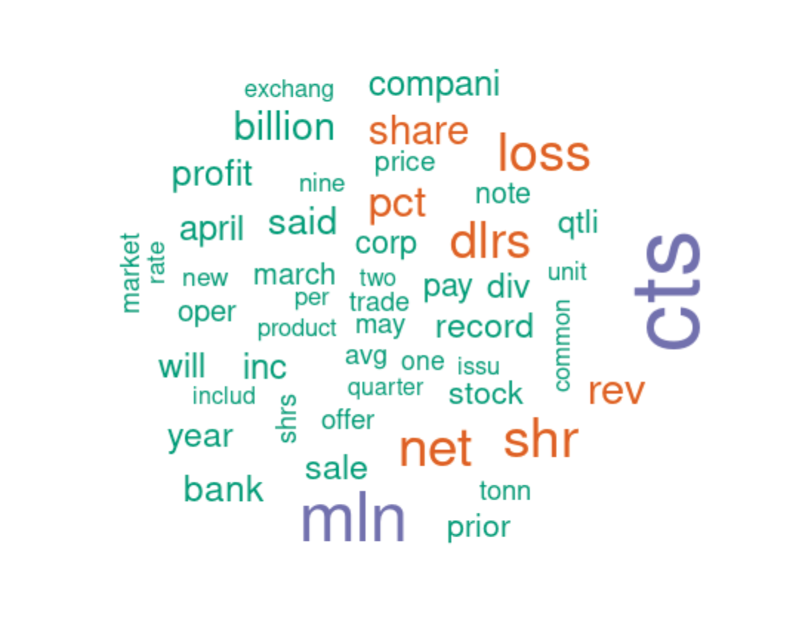
We can see that "cts", "mln" is the most frequent words.

```R
> bowdtm <- bowdtm[slam::row_sums(bowdtm) > 0, ]
> k <- 20
> result <- LDA(bowdtm, k, method="Gibbs", control=list(iter = 25, verbose = 25, alpha = 0.1))
K = 20; V = 32697; M = 19042
Sampling 25 iterations!
Iteration 25 ...
Gibbs sampling completed!
> result
A LDA_Gibbs topic model with 20 topics.
> terms(result, 10)
      Topic 1   Topic 2   Topic 3   Topic 4    Topic 5   Topic 6   Topic 7   Topic 8      Topic 9    Topic 10  Topic 11  Topic 12  Topic 13  Topic 14 Topic 15 
 [1,] "said"    "said"    "said"    "said"     "dlrs"    "billion" "said"    "tonn"       "bank"     "said"    "said"    "oil"     "said"    "pct"    "said"   
 [2,] "govern"  "will"    "trade"   "trade"    "mln"     "bank"    "market"  "said"       "said"     "share"   "reuter"  "said"    "export"  "will"   "share"  
 [3,] "econom"  "compani" "japan"   "reuter"   "said"    "pct"     "rate"    "mln"        "debt"     "compani" "mine"    "price"   "will"    "issu"   "stock"  
 [4,] "japan"   "new"     "offici"  "futur"    "year"    "franc"   "dollar"  "wheat"      "loan"     "stock"   "gold"    "gas"     "produc"  "said"   "compani"
 [5,] "offici"  "reuter"  "state"   "price"    "quarter" "said"    "bank"    "export"     "billion"  "reuter"  "will"    "barrel"  "price"   "mln"    "inc"    
 [6,] "minist"  "car"     "import"  "pct"      "compani" "year"    "trade"   "reuter"     "dlrs"     "court"   "compani" "product" "coffe"   "bond"   "dlrs"   
 [7,] "year"    "trade"   "japanes" "new"      "sale"    "mln"     "analyst" "agricultur" "will"     "offer"   "ton"     "mln"     "reuter"  "dlrs"   "offer"  
 [8,] "will"    "motor"   "unit"    "cent"     "earn"    "reuter"  "currenc" "year"       "interest" "file"    "oper"    "compani" "meet"    "rate"   "will"   
 [9,] "west"    "exchang" "will"    "tonn"     "share"   "foreign" "dealer"  "grain"      "countri"  "board"   "ounc"    "dlrs"    "countri" "reuter" "reuter" 
[10,] "japanes" "market"  "reuter"  "contract" "report"  "mark"    "exchang" "crop"       "new"      "inc"     "power"   "will"    "quota"   "manag"  "common" 
      Topic 16  Topic 17  Topic 18  Topic 19 Topic 20  
 [1,] "said"    "said"    "said"    "mln"    "pct"     
 [2,] "tax"     "compani" "compani" "cts"    "year"    
 [3,] "billion" "dlrs"    "will"    "net"    "said"    
 [4,] "budget"  "reuter"  "reuter"  "loss"   "billion" 
 [5,] "bill"    "share"   "inc"     "dlrs"   "februari"
 [6,] "stg"     "mln"     "corp"    "shr"    "januari" 
 [7,] "hous"    "corp"    "system"  "reuter" "rose"    
 [8,] "dlrs"    "inc"     "new"     "profit" "rise"    
 [9,] "reuter"  "group"   "servic"  "rev"    "last"    
[10,] "bank"    "will"    "comput"  "oper"   "month"  
```
We should remove empty rows in ``bowdtm`` and set number of topics to 20. Then we can compute the LDA model, inferencing via 25 iterations of Gibbs sampling.

We can see the 10 most likely terms within the term probabilities beta of the inferred topics.

We took eight sample documents:
```R
examples <- c(2, 100, 200, 400, 800, 1000, 1200, 1400)
lapply(pre_process_reuters[examples], as.character)

theta <- tmposterior$topics
N <- length(examples)

tpExamples <- theta[examples,]
colnames(tpExamples) <- nameOfTopics
vizDataFrame <- melt(cbind(data.frame(tpExamples), document = factor(1:N)), variable.name = "topic", id.vars = "document")  
vizDataFrame
```


### 6. Attach your code to the ZIP file.


## Task 3

This data comes from Twitter sentiment analysis in kaggle, From a data set ofnearly one million,  13,700 comments about Alan bryd were selected.  Amongthese  data,  9,700  positive  sentiment  data.   4000  negative  emotion  data.   Inorder to balance the data set, 4000 positive sentiment data and 4000 negativesentiment data were extracted.

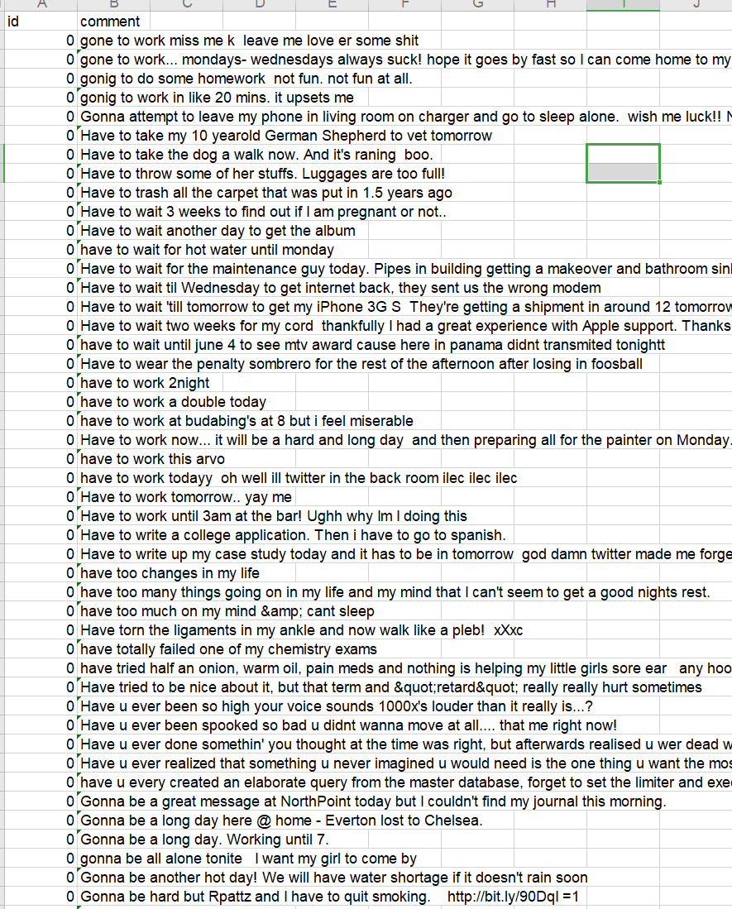

There are most characters in the comments,  such as emoji,  @ other usersand some garbled characters are inconsistent in capitalization. 

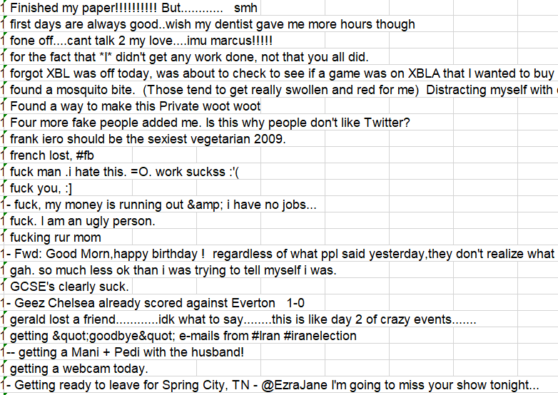

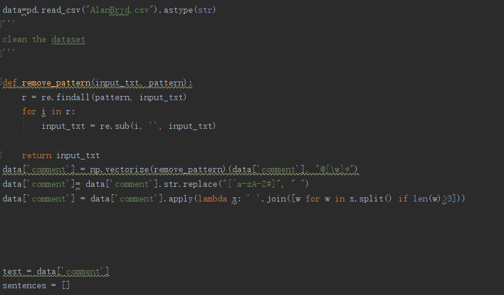
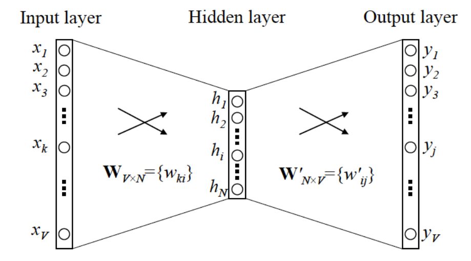
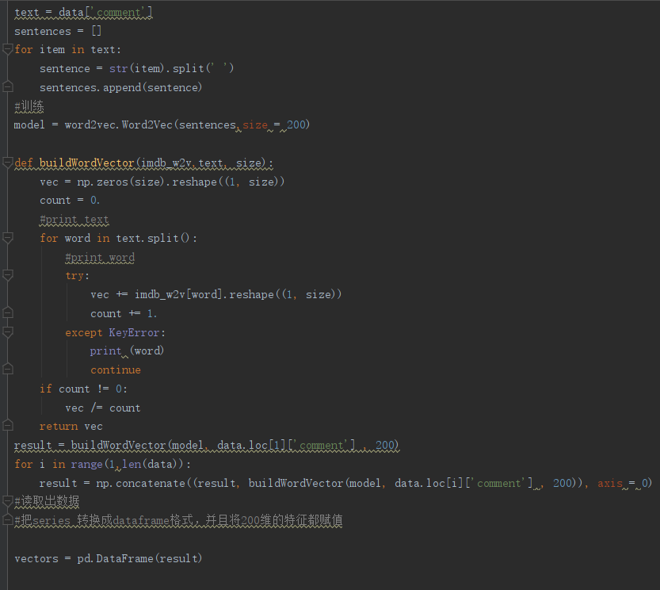
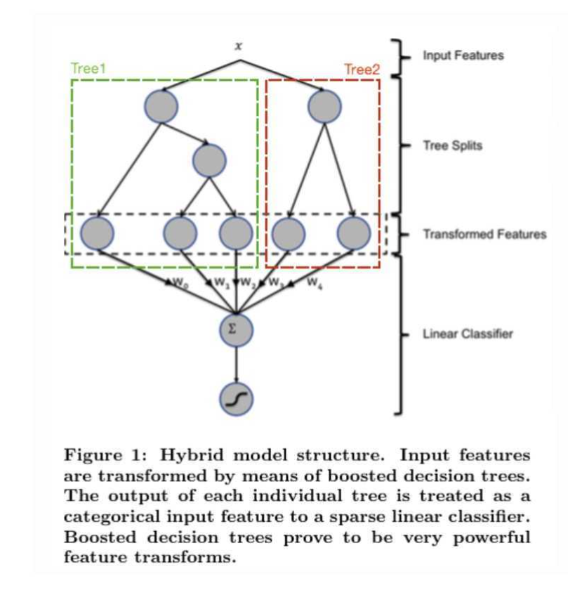
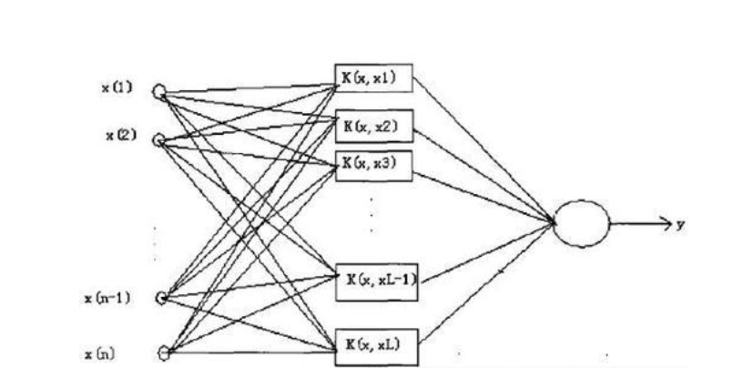
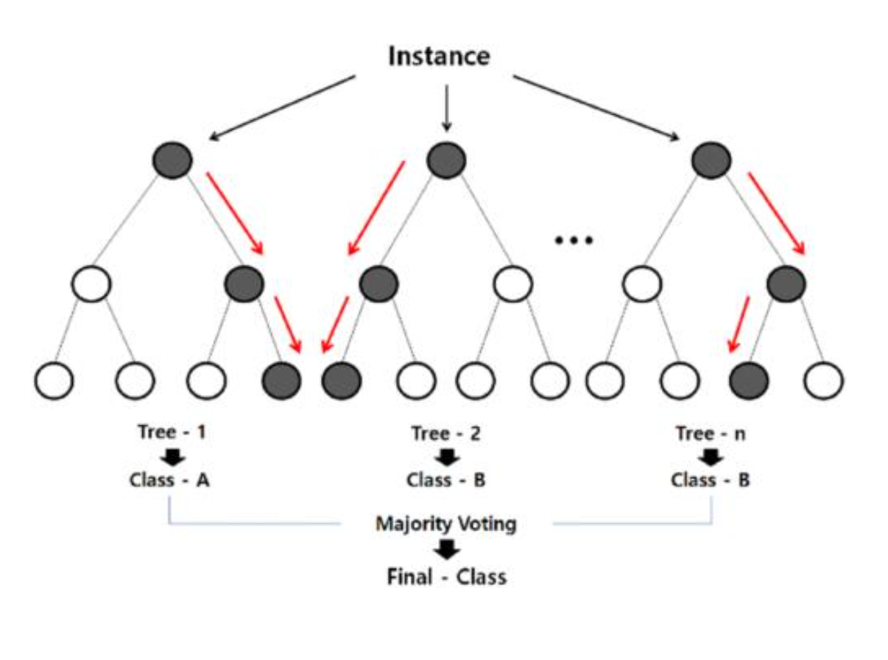
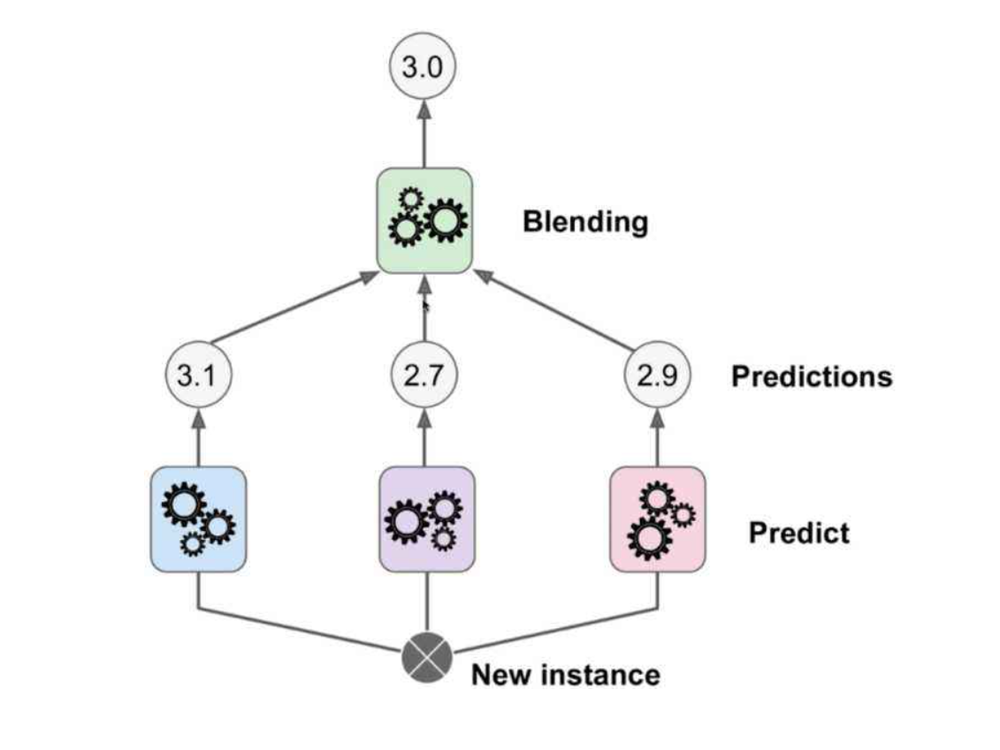
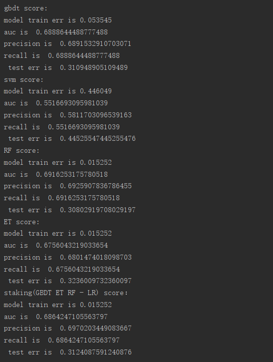
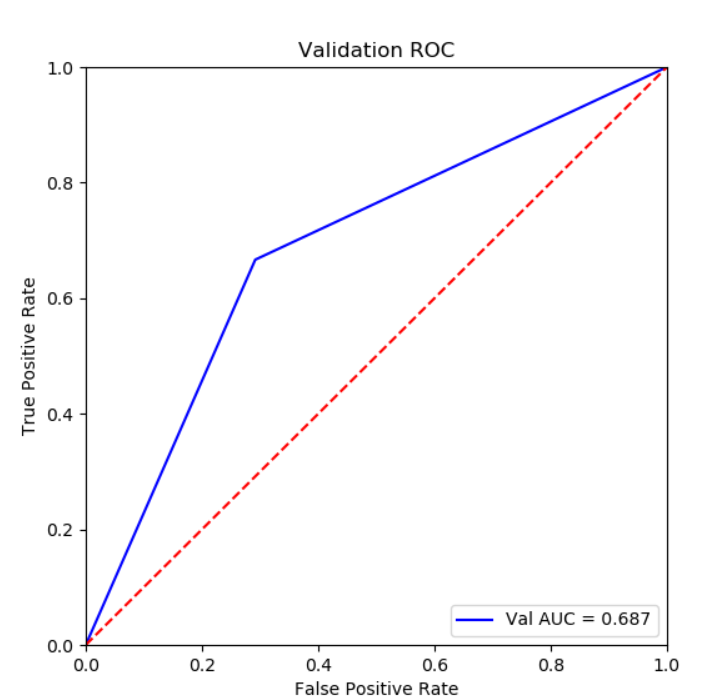