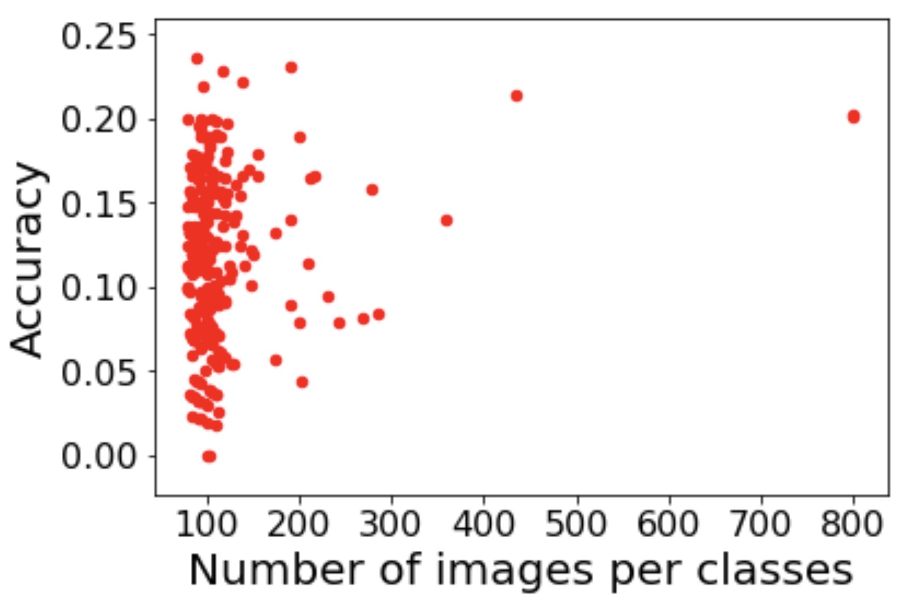

# Assignment 3

## Task3 

### Use the pre-trained Inception-BatchNorm network to classify object images.
Load packages
```r
require(mxnet)
require(imager)
```
Load models and mean image
```r
model = mx.model.load("Inception/Inception_BN", iteration=39)
mean.img = as.array(mx.nd.load("Inception/mean_224.nd")[["mean_img"]])
```
Classify the image
Now we are ready to classify the image! Use the predict function to get the probability over classes:

```r
prob <- predict(model, X=normed)
dim(prob)
```
```text
## [1] 1000    1
```
Use the max.col on the transpose of prob to get the class index:
```r
max.idx <- max.col(t(prob))
max.idx
```
```text
## [1] 89
```
read and print category name
```r
synsets <- readLines("Inception/synset.txt")
print(paste0("Predicted Top-class: ", synsets  [[max.idx]]))
```
```text
## [1] "Predicted Top-class: n01818515 macaw"
```

### The Caltech 256 datasets

The Caltech 256 is considered an improvement to its predecessor, the Caltech 101 dataset, with new features such as larger category sizes, new and larger clutter categories, and overall increased difficulty. This is a great dataset to train models for visual recognition. There are 30,607 images in this dataset spanning 257 object categories. Object categories are extremely diverse, ranging from grasshopper to tuning fork. The distribution of images per category are:

- Min: 80
- Med: 100
- Mean: 119
- Max: 827

### Extract feature representation for each image

Load and plot the image:

```r
im <- load.image(system.file("extdata/parrots.png", package="imager"))
plot(im)
```

Before feeding the image to the deep network, we need to perform some preprocessing to make the image meet the deep network input requirements. Preprocessing includes cropping and subtracting the mean. Because MXNet is deeply integrated with R, we can do all the processing in an R function:

```r
preproc.image <- function(im, mean.image) {
    # crop the image
    shape <- dim(im)
    short.edge <- min(shape[1:2])
    xx <- floor((shape[1] - short.edge) / 2)
    yy <- floor((shape[2] - short.edge) / 2)
    cropped <- crop.borders(im, xx, yy)
    # resize to 224 x 224, needed by input of the model.
    resized <- resize(cropped, 224, 224)
    # convert to array (x, y, channel)
    arr <- as.array(resized) * 255
    dim(arr) <- c(224, 224, 3)
    # subtract the mean
    normed <- arr - mean.img
    # Reshape to format needed by mxnet (width, height, channel, num)
    dim(normed) <- c(224, 224, 3, 1)
    return(normed)
}
```

Use the defined preprocessing function to get the normalized image:

```r
normed <- preproc.image(im, mean.img)
```


### SVM classifier

