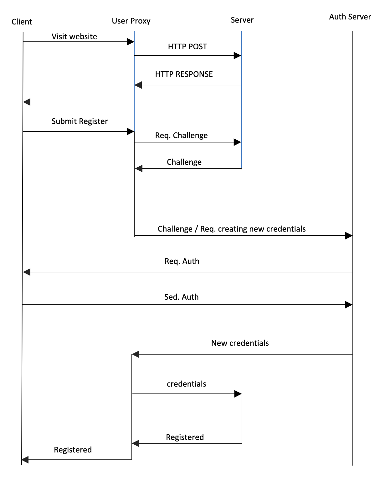

# Project 4

## Requirement analysis 
In this task, we need to add the identification protocol to the VPN service. 

We already know that the public key of the proxy server is known to the client in advance. Here we take advantage of the FIDO2 protocol (WebAuthn  standard) for  the identification. Local biometric authentication is required to unlock the private key according to the FIDO2 specification. (We use Pincode instead.)

## Protocol 
Here is the detail of the protocol.

Firstly, user visit the website (Get the front-end user interface) and then submit register form through front-end client to back-end server. Then, server generate challenge assembled with a uuid and send it to client. The client then choose one way to authenticate the register, which user send challenge request to Authenticate server. The Auth server then request user to verify the indetification by the biometrics or pincode way. The Auth server then generate private key $sk$ and public key $pk$ , and store $sk$ with uuid and user submitted information. The private key is to sigh the challenge, which should be send back to user client. After that, user should received the Authenticated  infomation and send them to server. The server check the information and use $pk$ to decrypt them, comparing with info received previously.

